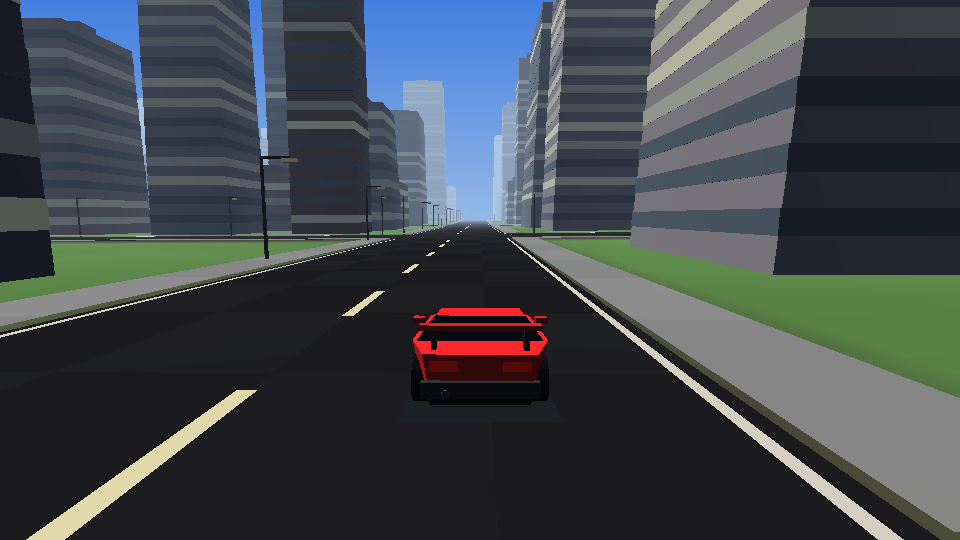
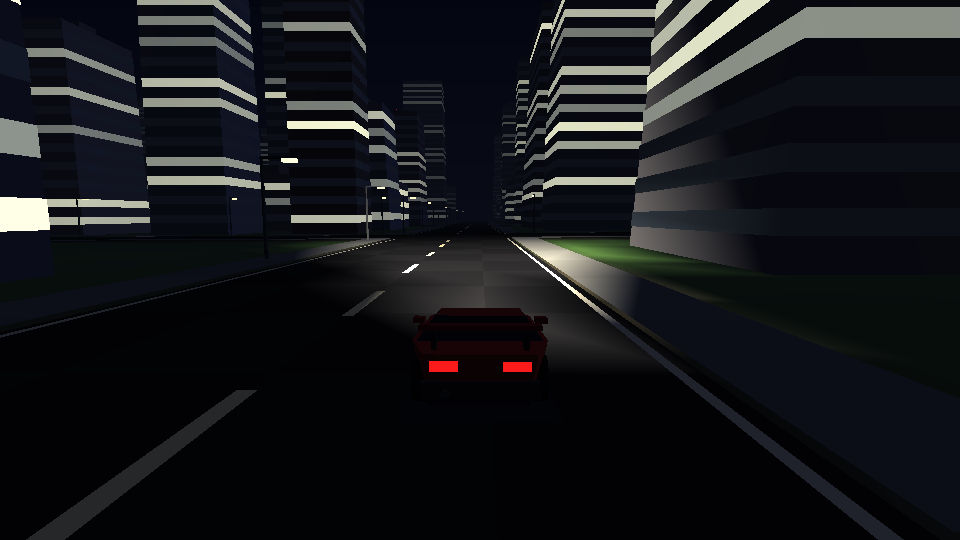
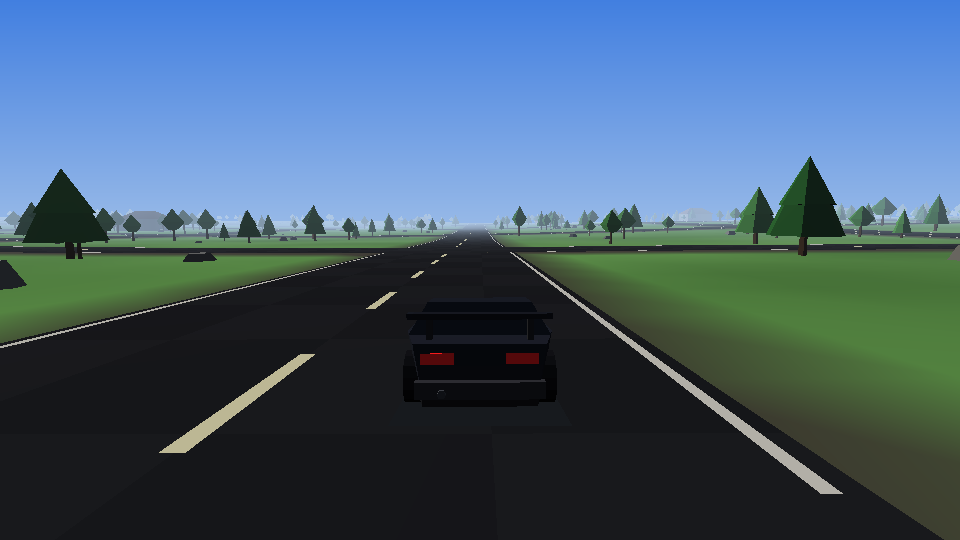

# İlker Drive

Android için açık dünya araba sürme oyunu. Sonsuz, prosedürel olarak üretilen
bir şehir ve kırsalda serbest sürüş: şerit çizgili yollar, kavşaklar, gökdelenler,
ağaçlar, sokak lambaları, trafik ve tam bir gündüz–gece döngüsü.

Oyun motoru dahil her şey bu depodaki Java kaynağından geliyor. Hiçbir hazır
oyun motoru, hiçbir 3B model dosyası, hiçbir doku, hiçbir ses dosyası yok —
araçların gövdeleri, binalar, arazi ve motor sesi hepsi kod içinde üretiliyor.
Bu yüzden APK sadece **87 KB**.

| | |
|---|---|
|  |  |
|  |  |

## Kurulum

`dist/ilker-drive-1.0.apk` dosyasını telefonuna kopyala ve aç. Android
"bilinmeyen kaynaklardan yükleme" izni isteyecek; tarayıcına veya dosya
yöneticine bu izni ver.

Android 5.0 (API 21) ve üzeri, OpenGL ES 2.0 destekleyen her cihazda çalışır.
Oyun yatay moda kilitlidir.

## Kontroller

| Kontrol | Yer |
|---|---|
| Direksiyon | Sol alttaki iki ok düğmesi |
| Gaz / Fren | Sağ alttaki yuvarlak düğmeler |
| El freni (drift) | Gazın üstündeki turuncu düğme |
| KAM | Kamerayı değiştirir: takip → kaput → geniş açı |
| ARAC | Garajdaki altı araç arasında geçiş yapar |
| ISIK | Farları açar / otomatiğe alır (gece kendiliğinden yanar) |
| EGIM | Telefonu yana yatırarak direksiyon. Açtığın andaki duruşun nötr kabul edilir |
| SIFIR | Takılırsan seni en yakın yola geri koyar |

Sol üstte pusula gibi dönen bir mini harita, altında mesafe / hız rekoru / saat,
ortada da hız göstergesi var. Sarı noktalar trafikteki diğer araçlar.

## Garaj

Altı aracın hepsi `CarSpec.GARAGE` içindeki sayılarla tanımlı — gövde oranları
ve yol tutuşu. Yeni bir araç eklemek için tek yapman gereken o diziye bir satır
daha yazmak.

| Araç | Son hız | Karakter |
|---|---|---|
| SIMSEK GT | 277 km/s | Alçak, geniş, en hızlısı |
| KARTAL SUV | 209 km/s | Yüksek, sağlam, kaldırımdan korkmaz |
| MINIK HATCH | 169 km/s | Kısa dingil, kavşaklarda çevik |
| KAS MUSCLE | 256 km/s | Uzun kaput, arkası kaygan — drift makinesi |
| YUK PICKUP | 184 km/s | Açık kasa, ağır, toprakta rahat |
| KLASIK SEDAN | 216 km/s | Dengeli |

## Derleme

Android SDK (platform 35, build-tools 35.0.0) ve JDK 17+ gerekiyor.
`local.properties` içine SDK yolunu yaz:

```
sdk.dir=/senin/android/sdk/yolun
```

Sonra:

```bash
gradle assembleRelease      # dist'teki APK böyle üretildi
gradle assembleDebug
```

Release derlemesi, `keystore.properties` yoksa debug anahtarıyla imzalanır —
yani kutudan çıktığı gibi derlenir ve kurulur. Kendi anahtarınla imzalamak
için depo kökünde şöyle bir dosya oluştur (bu dosya `.gitignore`'da):

```properties
storeFile=/yol/anahtar.jks
storePassword=...
keyAlias=...
keyPassword=...
```

> Not: `dist/` içindeki APK debug anahtarıyla imzalı. Yeni bir sürüm derlersen
> imza değişeceği için üstüne kuramazsın; önce eskisini kaldır. Kalıcı bir
> anahtar oluşturursan bu sorun ortadan kalkar.

## Doğrulama

Bu depoda emülatör gerektirmeyen bir test koşumu var. Oyunun **gerçek kaynak
dosyalarını** masaüstü JVM'de derleyip çalıştırır (`android.opengl.Matrix`
yerine birebir aynı davranan bir kopya konur):

```bash
tools/harness/run.sh            # 115 kontrol
tools/harness/run.sh --preview  # kontroller + docs/*.png görüntülerini yeniden üretir
```

Kontrol ettikleri: arazi yüksekliğinin sürekliliği ve belirleyiciliği, chunk
geometrisinin indeks sınırları içinde kalması, her üçgenin doğru yöne bakması
(arka yüz eleme yanlış sarımlı üçgenleri yutar), araç gövdelerinin tutarlılığı,
her aracın ilan ettiği son hıza ulaşması, frenin geri vitese geçmesi, el
freninin gerçekten kaydırması, toprakta yavaşlaması ve frustum elemesi.

`Preview.java` ise oyunun kendi gölgelendirici matematiğini taklit eden küçük
bir yazılımsal rasterleştirici — yukarıdaki ekran görüntüleri onunla üretildi.
İkisi de sadece geliştirme aracı, APK'ya girmiyorlar.

## Nasıl çalışıyor

```
app/src/main/java/com/ilker/opendrive/
├── MainActivity, GameView, GameRenderer   oyun döngüsü, kamera, ışık
├── gl/      MeshBuilder  prosedürel geometri (prizma, silindir, konik kutu)
│            Mesh, SceneProgram, HudProgram, Frustum, ShaderUtil
├── world/   Terrain      dünyanın tanımı: yükseklik, biyom, yol ağı
│            ChunkBuilder arazi + yol + bina + ağaç ağlarını üretir
│            World        oyuncunun etrafındaki chunk akışı
├── game/    CarSpec, CarMesh, Car, Traffic, CarModels
├── ui/      Hud, PixelFont
└── audio/   EngineSound  AudioTrack üzerine sentezlenen motor sesi
```

Dünyanın tamamı koordinatların saf bir fonksiyonu: `Terrain.height(x, z)`
her zaman aynı cevabı verir, bu yüzden chunk'lar herhangi bir sırada, herhangi
bir iş parçacığında üretilebilir ve birbirleriyle her zaman uyumlu olur. Chunk
üretimi iki arka plan iş parçacığında, GPU'ya yükleme ise kare başına en fazla
iki chunk ile sınırlı — böylece sürüş sırasında takılma olmuyor.

Sahnenin tamamı tek bir gölgelendiriciyle çiziliyor: yönlü güneş ışığı, gökyüzü
dolgusu, üstel sis, pencereler ve lambalar için ışıma kanalı, gece için far
konisi.

---

`index.html` bu depodaki ayrı bir proje (İlker web uygulaması) ve oyunla
ilgisi yoktur.
