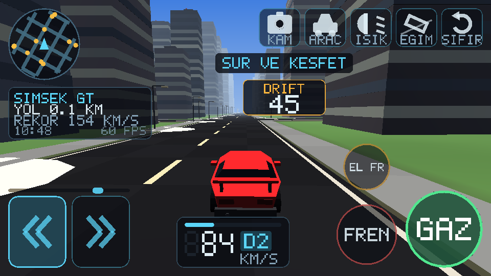

# İlker Drive

Android için açık dünya araba sürme oyunu. Sonsuz, prosedürel olarak üretilen
bir şehir ve kırsalda serbest sürüş: şerit çizgili yollar, kavşaklar, gökdelenler,
ağaçlar, sokak lambaları, trafik ve tam bir gündüz–gece döngüsü.

Oyun motoru dahil her şey bu depodaki Java kaynağından geliyor. Hiçbir hazır
oyun motoru, hiçbir 3B model dosyası, hiçbir doku, hiçbir ses dosyası yok —
araçların gövdeleri, binalar, arazi ve motor sesi hepsi kod içinde üretiliyor.
Bu yüzden APK sadece **94 KB**.

| | |
|---|---|
|  |  |
|  |  |

## Kurulum

`dist/ilker-drive-1.2.apk` dosyasını telefonuna kopyala ve aç. Android
"bilinmeyen kaynaklardan yükleme" izni isteyecek; tarayıcına veya dosya
yöneticine bu izni ver.

Android 5.0 (API 21) ve üzeri, OpenGL ES 2.0 destekleyen her cihazda çalışır.
Oyun yatay moda kilitlidir.

## Kontroller

| Kontrol | Yer |
|---|---|
| Direksiyon | Sol alt köşenin tamamı direksiyon bölgesi. Ortadan solda kalan dokunuş sola, sağda kalan sağa çevirir — ve **ne kadar dışta basarsan o kadar çok kırar**, yani düz yolda küçük düzeltme yapabilirsin |
| Gaz / Fren | Sağ alttaki yuvarlak düğmeler |
| El freni (drift) | Frenin üstündeki turuncu düğme |
| KAM | Kamerayı değiştirir: takip → kaput → geniş açı |
| ARAC | Garajdaki altı araç arasında geçiş yapar |
| ISIK | Far modu: otomatik → kısa → uzun → kapalı |
| EGIM | Telefonu yana yatırarak direksiyon. Açtığın andaki duruşun nötr kabul edilir |
| SIFIR | Takılırsan seni en yakın yola geri koyar |

Sol üstte pusula gibi dönen bir mini harita, altında mesafe / hız rekoru / saat,
altta ortada hız paneli var. Sarı noktalar trafikteki diğer araçlar. Ekranın
ortası bilerek boş bırakıldı — bakman gereken yer orası.

## Sürüş

Lastikler belirli bir kayma açısına kadar tutar, o açıyı geçince **tutuşu
bırakır ve bırakmaya devam eder** — direksiyonu geri alana kadar. Ters
direksiyonun bir işe yaramasının sebebi bu. Aynı döngüyü ağırlık transferi
besliyor: gazı keserek viraja girersen araç içeri döner, gazda kalırsan burun
dışarı kaçar.

Bunun yanında:

- **Patinaj** — güçlü araçlarda dururken tam gaz lastikleri döndürür, çekişi
  ve yanal tutuşu azaltır. El freni + gaz = kalkış dumanı.
- **Fren kilitlenmesi** — sert frende tekerler kilitlenir, direksiyon işlemez
  olur ve ön lastikler iz bırakır.
- **Lastik izleri** — kayan ve patinaj yapan tekerler yola gerçekten iz bırakır.
- **Çarpışma** — binalara, ağaçlara, kayalara ve sokak lambalarına çarpılır.
  Burnuna gelen sıyırma darbesi aracı döndürür; telefon da titrer.
- **Drift puanı** — yan giderken puan birikir, toparlayınca hanene yazılır.
- **Işıklar** — iki ayrı far konisi (kısa huzme aşağı, uzun huzme ileri ve
  uzağa), fren lambası, geri vites lambası, gece yanan sokak lambası havuzları
  ve trafikteki araçların farları.
- **Ses** — kayan lastiğin ciyaklaması, patinajda yükselen devir.
- **Kamera** — hızda ve bozuk zeminde titrer; kaput kamerasında daha çok.

## Garaj

Altı aracın hepsi `CarSpec.GARAGE` içindeki sayılarla tanımlı — gövde oranları
ve yol tutuşu. Yeni bir araç eklemek için tek yapman gereken o diziye bir satır
daha yazmak.

| Araç | Son hız | Karakter |
|---|---|---|
| SIMSEK GT | 277 km/s | Alçak, geniş, en hızlısı |
| KARTAL SUV | 209 km/s | Yüksek, sağlam, kaldırımdan korkmaz |
| MINIK HATCH | 169 km/s | Kısa dingil, kavşaklarda çevik |
| KAS MUSCLE | 256 km/s | Uzun kaput, arkası kaygan — drift makinesi |
| YUK PICKUP | 184 km/s | Açık kasa, ağır, toprakta rahat |
| KLASIK SEDAN | 216 km/s | Dengeli |

## Derleme

Android SDK (platform 35, build-tools 35.0.0) ve JDK 17+ gerekiyor.
`local.properties` içine SDK yolunu yaz:

```
sdk.dir=/senin/android/sdk/yolun
```

Sonra:

```bash
gradle assembleRelease      # dist'teki APK böyle üretildi
gradle assembleDebug
```

Release derlemesi, `keystore.properties` yoksa debug anahtarıyla imzalanır —
yani kutudan çıktığı gibi derlenir ve kurulur. Kendi anahtarınla imzalamak
için depo kökünde şöyle bir dosya oluştur (bu dosya `.gitignore`'da):

```properties
storeFile=/yol/anahtar.jks
storePassword=...
keyAlias=...
keyPassword=...
```

> Not: `dist/` içindeki APK debug anahtarıyla imzalı. Yeni bir sürüm derlersen
> imza değişeceği için üstüne kuramazsın; önce eskisini kaldır. Kalıcı bir
> anahtar oluşturursan bu sorun ortadan kalkar.

## Doğrulama

Bu depoda emülatör gerektirmeyen bir test koşumu var. Oyunun **gerçek kaynak
dosyalarını** masaüstü JVM'de derleyip çalıştırır (`android.opengl.Matrix`
yerine birebir aynı davranan bir kopya konur):

```bash
tools/harness/run.sh            # 161 kontrol
tools/harness/run.sh --preview  # kontroller + docs/*.png görüntülerini yeniden üretir
```

Kontrol ettikleri: arazi yüksekliğinin sürekliliği ve belirleyiciliği, chunk
geometrisinin indeks sınırları içinde kalması, her üçgenin doğru yöne bakması
(arka yüz eleme yanlış sarımlı üçgenleri yutar), araç gövdelerinin tutarlılığı,
her aracın ilan ettiği son hıza ulaşması, frenin geri vitese geçmesi, el
freninin gerçekten kaydırması, toprakta yavaşlaması ve frustum elemesi.

Ayrıca **direksiyonun doğru yöne çevirmesi**: aracın gittiği yön, "sağ"ın
tanımından (ileri × yukarı çapraz çarpımı) bağımsız olarak, üç farklı başlangıç
açısında ve iki yönde de doğrulanıyor. Bu testin ilk hâli benim yanlış
varsayımımı tekrarladığı için hatayı yakalayamamıştı; şimdi kodun iç
işaret kuralına değil, geometrinin tanımına bakıyor.

**Arayüz testi** ise tek bir parmağı beş farklı ekran oranında (16:9'dan 5:4'e)
ekranın her yerinde gezdirip hiçbir noktanın aynı anda iki kontrolü birden
tetiklemediğini doğruluyor — geliştiricinin kendi telefonunda görünmeyen,
başkasının telefonunda sinir bozucu olan türden bir hata.

**Çarpışma testi** en kritiği: dünya üreticisinin çizdiği duvarlarla çarpışma
kutularının aynı yerde olduğunu doğruluyor. Bunun için bina yerleşimi ile bina
görünümü ayrı rastgele akışlardan besleniyor; böylece çarpışma yürüyüşü hiçbir
renk veya pencere sayısı okumadan mesh'in gezdiği aynı binaları geziyor. Test
iki yönü de kontrol ediyor: bildirilen her kutunun üstünde gerçekten bir bina
var mı, ve araç gövdesi yüksekliğindeki her katı yüzey çarpışma listesinde mi.
Ayrıca bir araç duvara sürülüp içine girmediği ve hız kaybettiği ölçülüyor.

`Preview.java` oyunun kendi gölgelendirici matematiğini taklit eden küçük bir
yazılımsal rasterleştirici; `HudPreview.java` ise gerçek `Hud` kodunu masaüstünde
çalıştırıp ürettiği üçgenleri o sahnenin üzerine çiziyor. Yukarıdaki ekran
görüntüleri bunlarla üretildi — yani arayüz, cihaz olmadan da gerçekten
görülerek tasarlandı. Hepsi geliştirme aracı, APK'ya girmiyorlar.

## Nasıl çalışıyor

```
app/src/main/java/com/ilker/opendrive/
├── MainActivity, GameView, GameRenderer   oyun döngüsü, kamera, ışık
├── gl/      MeshBuilder  prosedürel geometri (prizma, silindir, konik kutu)
│            Mesh, SceneProgram, HudProgram, Frustum, ShaderUtil
├── world/   Terrain      dünyanın tanımı: yükseklik, biyom, yol ağı
│            ChunkBuilder arazi + yol + bina + ağaç ağlarını üretir
│            World        oyuncunun etrafındaki chunk akışı
├── game/    CarSpec, CarMesh, Car, Traffic, CarModels
├── ui/      Hud, PixelFont
└── audio/   EngineSound  AudioTrack üzerine sentezlenen motor sesi
```

Dünyanın tamamı koordinatların saf bir fonksiyonu: `Terrain.height(x, z)`
her zaman aynı cevabı verir, bu yüzden chunk'lar herhangi bir sırada, herhangi
bir iş parçacığında üretilebilir ve birbirleriyle her zaman uyumlu olur. Chunk
üretimi iki arka plan iş parçacığında, GPU'ya yükleme ise kare başına en fazla
iki chunk ile sınırlı — böylece sürüş sırasında takılma olmuyor.

Sahnenin tamamı tek bir gölgelendiriciyle çiziliyor: yönlü güneş ışığı, gökyüzü
dolgusu, üstel sis, pencereler ve lambalar için ışıma kanalı, gece için far
konisi.

---

`index.html` bu depodaki ayrı bir proje (İlker web uygulaması) ve oyunla
ilgisi yoktur.
