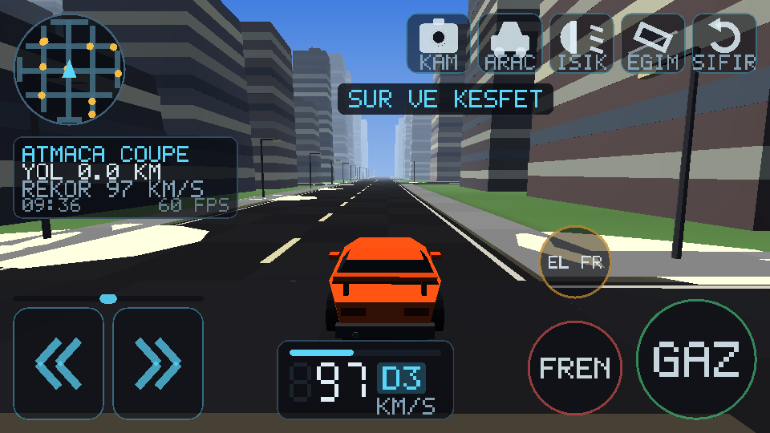
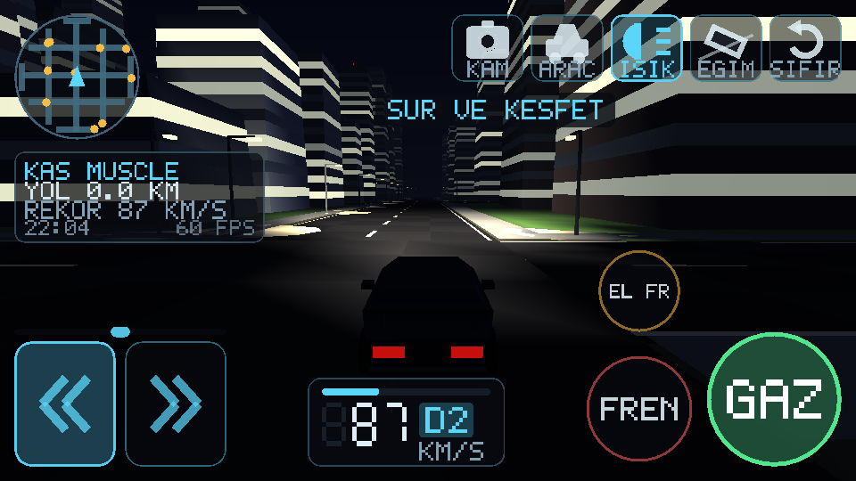
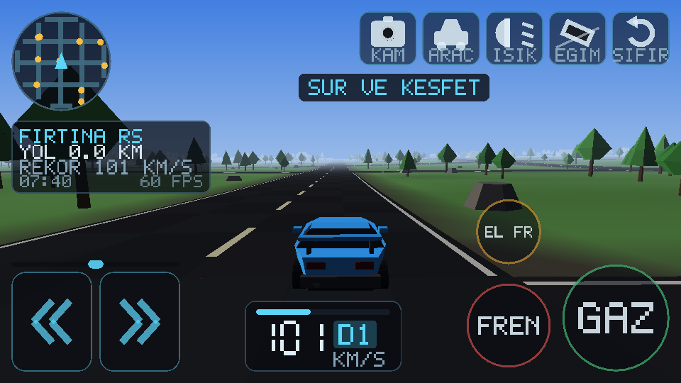
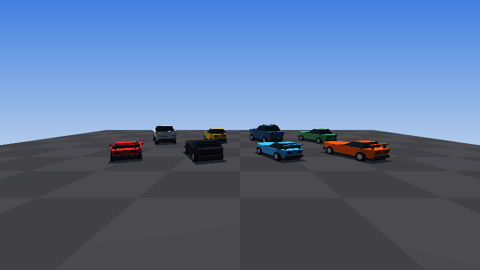

# İlker Drive

Android için açık dünya araba sürme oyunu. Sonsuz, prosedürel olarak üretilen
bir şehir ve kırsalda serbest sürüş: şerit çizgili yollar, kavşaklar, gökdelenler,
ağaçlar, sokak lambaları, trafik ve tam bir gündüz–gece döngüsü.

Oyun motoru dahil her şey bu depodaki Java kaynağından geliyor. Hiçbir hazır
oyun motoru, hiçbir 3B model dosyası, hiçbir doku, hiçbir ses dosyası yok —
araçların gövdeleri, binalar, arazi ve motor sesi hepsi kod içinde üretiliyor.
Bu yüzden APK sadece **96 KB**.

| | |
|---|---|
|  |  |
|  |  |

## Kurulum

`dist/ilker-drive-1.6.apk` dosyasını telefonuna kopyala ve aç. Android
"bilinmeyen kaynaklardan yükleme" izni isteyecek; tarayıcına veya dosya
yöneticine bu izni ver.

Android 5.0 (API 21) ve üzeri, OpenGL ES 2.0 destekleyen her cihazda çalışır.
Oyun yatay moda kilitlidir.

## Kontroller

| Kontrol | Yer |
|---|---|
| Direksiyon | Sol alt köşenin tamamı direksiyon bölgesi. Ortadan solda kalan dokunuş sola, sağda kalan sağa çevirir — ve **ne kadar dışta basarsan o kadar çok kırar**, yani düz yolda küçük düzeltme yapabilirsin |
| Gaz / Fren | Sağ alttaki yuvarlak düğmeler |
| El freni | Frenin üstündeki turuncu düğme. Aracı hızlı durdurur ve yokuşta tutar |
| KAM | Kamerayı değiştirir: takip → kaput → geniş açı |
| ARAC | Garajdaki sekiz araç arasında geçiş yapar |
| ISIK | Far modu: otomatik → kısa → uzun → kapalı |
| EGIM | Telefonu yana yatırarak direksiyon. Açtığın andaki duruşun nötr kabul edilir |
| SIFIR | Takılırsan seni en yakın yola geri koyar |

Sol üstte pusula gibi dönen bir mini harita, altında mesafe / hız rekoru / saat,
altta ortada hız paneli var. Sarı noktalar trafikteki diğer araçlar. Ekranın
ortası bilerek boş bırakıldı — bakman gereken yer orası.

## Sürüş

Buradaki temel kural şu: **araç sürüldüğünde oturur.** Virajı lastiklerine
yaslanarak alır, savrulmaz.

Araç iki akslı bir lastik modeliyle sürülüyor. Ön ve arka aksın kendi kayma
açısı, kendi tutuş tavanı var; dönme hızı ise direksiyonun bir fonksiyonu değil,
kendi ataleti olan gerçek bir durum. Yani araç dönmeye başladığında o dönüşü
bir an taşır — viraja giriş ve çıkış anlık değil, bir ağırlığı var.

Her aracın **dengesi** ölçülüyor: ön aksın taşıdığı ağırlığa göre tutuşu, arka
aksınkini geçerse araç belli bir hızın üstünde ne yaparsan yap fırıl döner.
Garajdaki sekiz aracın hepsi bu sınırın rahat tarafında — testler bunu her
derlemede 384 ayrı koşuyla doğruluyor.

**Direksiyon hıza göre kısılıyor.** Park etmeni sağlayan kilit, 120 km/s'te
aracı savurmaktan başka işe yaramaz; gerçek sürücü o hızda iki üç derece
kullanır. Yüksek hızda ince düzeltme yapabilirsin, park ederken tam kilidin
elinde olur.

Motor **gerçek bir şanzımandan** çekiyor: bir tork eğrisi, içinde bulunduğu
vitesin oranıyla çarpılıyor. Vites değişiminde tork kesilir ve devir düşer —
duyduğun vites değişimi aracın gerçekten yaptığı vites değişimi. GT 3.6
saniyede 100'e çıkarken hatchback 9.6 saniye alıyor.

Gövde zemine yapışık değil: kendi dikey hızını taşıyor. **Kaldırımdan hızlı
inersen araç havalanır**, yerçekimi geri indirir, yaylar oturur. Yerçekimi
yokuş boyunca da etki ediyor — yokuş yukarı yavaşlarsın, aşağı hızlanırsın,
ve el freni çekmezsen park ettiğin araç geri kaçar.

Bunun yanında:

- **Ağırlık transferi** — gaza ve frene göre; hava direncine göre değil. Bu
  ayrım önemli: net ivmeden hesaplanınca otoyol hızında sırf hava direnci aracı
  burnuna yatırıp arkayı hafifletiyor ve en ufak direksiyonda savuruyor.
- **Sürtünme dairesi** — aracı ileri itmek için harcanan tutuş, onu döndürmek
  için kalmaz. İki aksa birden uygulanıyor, yani tam gaz dengeyi bozmaz.
- **Patinaj** — güçlü araçlarda dururken tam gaz lastikleri döndürür.
- **Fren kilitlenmesi** — sert frende tekerler kilitlenir, direksiyon işlemez
  olur ve ön lastikler iz bırakır.
- **Lastik izleri** — kayan ve patinaj yapan tekerler yola gerçekten iz bırakır.
- **Çarpışma** — binalara, ağaçlara, kayalara ve sokak lambalarına çarpılır.
- **Işıklar** — iki ayrı far konisi, fren lambası, geri vites lambası, gece
  yanan sokak lambası havuzları ve trafikteki araçların farları.
- **Ses** — kayan lastiğin ciyaklaması, patinajda yükselen devir.
- **Kamera** — hızda, bozuk zeminde ve sert inişlerde titrer.
- **Trafik** — önündeki araç senin için yavaşlar ve stop lambaları yanar.
- **Geri vites** — dururken frene basınca geri vites seçilir; geri viteste
  fren pedalı gaz, gaz pedalı fren olur.

## Garaj

Sekiz aracın hepsi `CarSpec.GARAGE` içindeki sayılarla tanımlı. Yeni bir araç
eklemek için tek yapman gereken o diziye bir satır daha yazmak.

`DENGE` aracın kararlılığı: 1'in altında araç kararlıdır, 1'e yaklaştıkça
çevikleşir, 1'i geçerse kurtarılamaz biçimde savrulur — o yüzden hiçbiri
geçmiyor, test de bunu zorluyor.

| Araç | 0-100 | Son hız | Denge | Karakter |
|---|---|---|---|---|
| ATMACA COUPE | 4.5 sn | 230 km/s | 0.86 | Alçak ve hafif; yön değiştirmekte en çevik olanı |
| FIRTINA RS | 4.3 sn | 248 km/s | 0.86 | Kısa, keskin, virajlı yolda oynak |
| KAS MUSCLE | 4.2 sn | 256 km/s | 0.85 | Uzun kaput, büyük motor; düzlüğü virajdan çok sever |
| SIMSEK GT | 3.6 sn | 277 km/s | 0.84 | Hızlısı: en çok güç, en çok tutuş, en yüksek son hız |
| KLASIK SEDAN | 6.5 sn | 216 km/s | 0.82 | Aklı başında olan; hiçbir hareketi seni şaşırtmaz |
| KARTAL SUV | 7.4 sn | 209 km/s | 0.79 | Yüksek, sağlam, kaldırımdan korkmaz, geç döner |
| MINIK HATCH | 9.6 sn | 169 km/s | 0.77 | Yavaş ama kısa; kavşak hızında en çevik olanı |
| YUK PICKUP | 9.6 sn | 184 km/s | 0.82 | Açık kasa, ağır, sakin. Toprakta rahat |

## Derleme

Android SDK (platform 35, build-tools 35.0.0) ve JDK 17+ gerekiyor.
`local.properties` içine SDK yolunu yaz:

```
sdk.dir=/senin/android/sdk/yolun
```

Sonra:

```bash
gradle assembleRelease      # dist'teki APK böyle üretildi
gradle assembleDebug
```

Release derlemesi, `keystore.properties` yoksa debug anahtarıyla imzalanır —
yani kutudan çıktığı gibi derlenir ve kurulur. Kendi anahtarınla imzalamak
için depo kökünde şöyle bir dosya oluştur (bu dosya `.gitignore`'da):

```properties
storeFile=/yol/anahtar.jks
storePassword=...
keyAlias=...
keyPassword=...
```

> Not: `dist/` içindeki APK debug anahtarıyla imzalı. Yeni bir sürüm derlersen
> imza değişeceği için üstüne kuramazsın; önce eskisini kaldır. Kalıcı bir
> anahtar oluşturursan bu sorun ortadan kalkar.

## Doğrulama

Bu depoda emülatör gerektirmeyen bir test koşumu var. Oyunun **gerçek kaynak
dosyalarını** masaüstü JVM'de derleyip çalıştırır (`android.opengl.Matrix`
yerine birebir aynı davranan bir kopya konur):

```bash
tools/harness/run.sh            # 227 kontrol
tools/harness/run.sh --preview  # kontroller + docs/*.png görüntülerini yeniden üretir
```

Kontrol ettikleri: arazi yüksekliğinin sürekliliği ve belirleyiciliği, chunk
geometrisinin indeks sınırları içinde kalması, her üçgenin doğru yöne bakması
(arka yüz eleme yanlış sarımlı üçgenleri yutar), araç gövdelerinin tutarlılığı,
her aracın ilan ettiği son hıza ulaşması, frenin geri vitese geçmesi, el
freninin gerçekten kaydırması, toprakta yavaşlaması ve frustum elemesi.

**Sürüş mekaniği testleri**: her aracın altı vitesi de kullanması ve vites
değişiminde devrin düşmesi, devir sınırlayıcısının tutması, yavaşlarken vites
küçültmesi, her aracın 0-100 süresinin inandırıcı bir aralıkta olması, yokuşta
park eden aracın geri kaçması ve el freninin onu tutması, kaldırımdan hızlı
inen aracın havalanıp geri inmesi, süspansiyonun dururken oturması.

**Kararlılık testleri** en önemlisi, çünkü eksikliği gerçek bir hatayı
gizlemişti: sekiz aracın her biri, dört ayrı hızda, dört ayrı direksiyon
miktarında ve üç ayrı gaz konumunda — 384 kombinasyon — virajı kaymadan alıyor
mu diye bakıyor. Ayrıca her aracın yapısal olarak kararlı olduğu (arka aksın
taşıdığı yüke göre tutuşunun yeterli olduğu), tam gazda dümdüz gittiği, viraj
ortasında gaz kesilince ters dönmediği ve direksiyonun hızla kısıldığı
doğrulanıyor.

Bu testler yazılmadan önce **sekiz aracın sekizi de her hızda fırıl dönüyordu**;
0.25 direksiyon bile yetiyordu. O zamanki testler yalnızca araçları birbiriyle
karşılaştıran göreli sorular soruyordu — "şu araç bundan daha çok kayıyor mu"
gibi. İki araç da savrulurken bu sorunun cevabı doğru çıkar. Bir test takımının
en tehlikeli boşluğu yanlış cevaplanan soru değil, hiç sorulmamış olandır.

**Arayüz testi** ise tek bir parmağı beş farklı ekran oranında (16:9'dan 5:4'e)
ekranın her yerinde gezdirip hiçbir noktanın aynı anda iki kontrolü birden
tetiklemediğini doğruluyor — geliştiricinin kendi telefonunda görünmeyen,
başkasının telefonunda sinir bozucu olan türden bir hata.

**Çarpışma testi** en kritiği: dünya üreticisinin çizdiği duvarlarla çarpışma
kutularının aynı yerde olduğunu doğruluyor. Bunun için bina yerleşimi ile bina
görünümü ayrı rastgele akışlardan besleniyor; böylece çarpışma yürüyüşü hiçbir
renk veya pencere sayısı okumadan mesh'in gezdiği aynı binaları geziyor. Test
iki yönü de kontrol ediyor: bildirilen her kutunun üstünde gerçekten bir bina
var mı, ve araç gövdesi yüksekliğindeki her katı yüzey çarpışma listesinde mi.
Ayrıca bir araç duvara sürülüp içine girmediği ve hız kaybettiği ölçülüyor.

`Preview.java` oyunun kendi gölgelendirici matematiğini taklit eden küçük bir
yazılımsal rasterleştirici; `HudPreview.java` ise gerçek `Hud` kodunu masaüstünde
çalıştırıp ürettiği üçgenleri o sahnenin üzerine çiziyor. Yukarıdaki ekran
görüntüleri bunlarla üretildi — yani arayüz, cihaz olmadan da gerçekten
görülerek tasarlandı. Hepsi geliştirme aracı, APK'ya girmiyorlar.

## Nasıl çalışıyor

```
app/src/main/java/com/ilker/opendrive/
├── MainActivity, GameView, GameRenderer   oyun döngüsü, kamera, ışık
├── gl/      MeshBuilder  prosedürel geometri (prizma, silindir, konik kutu)
│            Mesh, SceneProgram, HudProgram, Frustum, ShaderUtil
├── world/   Terrain      dünyanın tanımı: yükseklik, biyom, yol ağı
│            ChunkBuilder arazi + yol + bina + ağaç ağlarını üretir
│            World        oyuncunun etrafındaki chunk akışı
├── game/    CarSpec, CarMesh, Car, Traffic, CarModels
├── ui/      Hud, PixelFont
└── audio/   EngineSound  AudioTrack üzerine sentezlenen motor sesi
```

Dünyanın tamamı koordinatların saf bir fonksiyonu: `Terrain.height(x, z)`
her zaman aynı cevabı verir, bu yüzden chunk'lar herhangi bir sırada, herhangi
bir iş parçacığında üretilebilir ve birbirleriyle her zaman uyumlu olur. Chunk
üretimi iki arka plan iş parçacığında, GPU'ya yükleme ise kare başına en fazla
iki chunk ile sınırlı — böylece sürüş sırasında takılma olmuyor.

Sahnenin tamamı tek bir gölgelendiriciyle çiziliyor: yönlü güneş ışığı, gökyüzü
dolgusu, üstel sis, pencereler ve lambalar için ışıma kanalı, gece için far
konisi.

---

`index.html` bu depodaki ayrı bir proje (İlker web uygulaması) ve oyunla
ilgisi yoktur.
